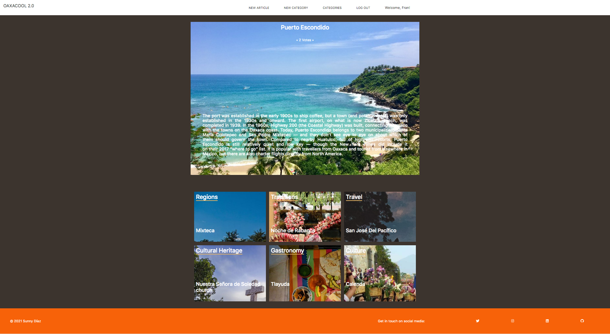

# Oaxacool 2.0

A blog that shows Oaxacan lifestyle and culture



## Video presentation

https://www.loom.com/share/f28270bf681042878d639daf3fb7ee94

## Live version

https://oaxacool2.herokuapp.com/

## Built with

- Ruby
- Ruby on Rails
- Bootstrap

## Prerequisites

$ Ruby: 2.5.8$

$ Rails: 5.2.6$

$ Postgres: 9.5$

## How to use

Clone Repository
```
$ git clone https://github.com/SunnySparks/Lifestyle-articles.git

```

Access your repository by typing in your terminal
```
$ cd lifestyle-articles

```

Install dependencies
```
$ bundle install

```

Setup database with:
```
$ rails db:create
rails db:migrate

```

Run the app
```
$ rails server

```

Open `http://localhost:3000/` in your browser.

Run tests
```
$ rspec

```


## Author


👤 **Sunny Díaz**

- GitHub: [@SunnySparks](https://github.com/SunnySparks)
- Twitter: [@JosfranT6](https://twitter.com/JosFranT6)
- Instagram: [@webdev.sunnydiaz](https://www.instagram.com/webdev.sunnydiaz/)

## 🤝 Contributing

Contributions, issues and feature requests are welcome!

Feel free to check the [issues page](https://github.com/SunnySparks/Lifestyle-articles/issues).

## Show your support

Give a ⭐️ if you like this project!


## 📝 License

-This project is MIT licensed.
